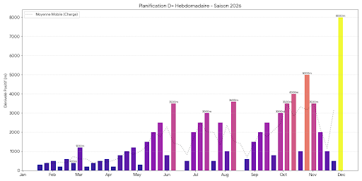
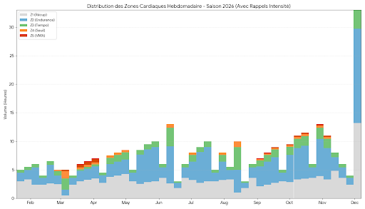

*Into the unknown: Night training for the 100-miler.*

I am preparing for my **first 100-miler** (168km). 
At this distance, the margin for error is zero. A shaky, generic, or poorly calibrated plan doesn't just mean a "bad race" (DNF). It means **avoidable injuries** and months of rehab.

As a Data Scientist, I refuse to trust my joints to a static "Ultra in 12 weeks" PDF found on Google. I need precision, adaptability, and safety.

I have 3 years of training data sitting in TrainingPeaks. I have specific constraints (a job, an explosive husky, and "old man" joints at 34).
Instead of hiring a human coach or relying on a black-box algorithm, I decided to build a **"Board of Directors"** using the best LLMs available.

This post details the methodology, the workflow, and provides the **exact System Prompt** I use.

## 1. The Core Problem: Context Drift

One fundamental flaw of LLMs is **Context Drift**. 
If you feed a model your goals in January, by March it often "forgets" your initial constraints or hallucinates volume increases that defy physiological logic.

To solve this, I don't ask for a "Season Plan". I built a **Hierarchical State Machine**.
I split the problem into **4 Layers**, where each layer locks the constraints for the next.

## 2. The Architecture: A 4-Layer Cascade

### Layer 1: The Macro-Vision (Season Skeleton)
First, I use an **Adversarial Strategy**. I treat **Gemini (The Analyst)** and **ChatGPT (The Strategist)** as two stubborn consultants.
* **Gemini** analyzes my 3 years of CSV data (Injury logs, Volume tolerance).
* **ChatGPT** proposes a periodization structure.
* **Goal:** They must agree on the **Season Phasing** (e.g., "Feb-Mar: Base Building", "Apr: Threshold").

### Layer 2: The "Phase Specs" (State Persistence)
**This is the crucial engineering step.** Before writing a single workout, I extract and **log** the numerical constraints for the current Phase. 
For a "Base 1" phase, I freeze these variables in a JSON-like format:
* *Total Weekly Volume:* 8h → 10h progression.
* *Zone Distribution:* 85% Z1/Z2 | 15% Z3+.
* *Elevation Gain target:* 2000m/week.

> *Why?* By freezing these numbers, the LLM cannot "drift". These specs act as the **Ground Truth** for the next layer.

### Layer 3: The Block Generation (Meso-Cycle)
At the start of every 4-week block (3 weeks load + 1 week assimilation), I feed the **Phase Specs** (Layer 2) to the System Prompt.
The LLM generates the specific sessions. It doesn't need to "guess" the volume; it just executes the specs defined in Layer 2.

### Layer 4: The Daily Forward Loop (Feedback Control)
A plan survives until first contact with reality.
This is the dynamic loop that runs **every single morning**:

1.  **Read Context:**
    * **Input A:** Yesterday's Session RPE (Rate of Perceived Exertion).
    * **Input B:** Today's Morning HRV & Resting Heart Rate.
2.  **Decision Logic:**
    * *Was yesterday harder than expected (RPE > 8)?* → Downgrade today's intensity.
    * *Is HRV crashing?* → Switch Interval to Z2 Recovery.
3.  **Update Plan:** The session is modified *before* I tie my shoelaces.


## 3. The Blueprint: Visualizing the Season

It is hard to spot structural errors in a text table. It is easy in a chart.
I asked Gemini to not only plan the season but to **write the Python code** to visualize the periodization.

### A. Volume Strategy (Bike vs. Run)

*Strategy:* To protect my joints, I use a high volume of cycling (Blue) in the base phase. Specific running volume (Orange) only takes over 8-12 weeks before key races.
<br>


### B. Elevation Progression (D+)
*Strategy:* Progressive overload is key. Notice the specific "Shock Blocks" peaking at 4000m+ and 5000m+ D+ before the final taper.
<br>


### C. Intensity Distribution
*Strategy:* Strict Polarization. The gray/blue mass represents Zone 1/Zone 2 volume. The red spikes are carefully placed "Intensity Injections" to maintain VO2 Max without burnout.
<br>



## 4. The Source Code: My System Prompt

This prompt is used in Layer 3 (Block Generation). "Garbage In, Garbage Out." If you don't give the AI strict constraints, it produces fluff.
Copy-Paste this template and replace the [BRACKETS] with your data.

```markdown
# ROLE
You are my Expert Ultra-Trail and Strength & Conditioning Coach. 
Your mission is to get me to the finish line of [TARGET RACE NAME] ([DISTANCE]km, [ELEVATION]m D+) on [DATE] with a target Performance Index of [TARGET INDEX].

# COACHING PRINCIPLES
1. **Direct & Factual:** No fluff, no "cheerleading". Be objective.
2. **Data-Driven:** Decisions must be based on historical files and daily metrics.
3. **Progressive:** Respect periodization (Base -> Build -> Peak -> Taper).

# ATHLETE PROFILE
- **Age:** [AGE] | **Weight:** [WEIGHT]kg
- **Background:** [YOUR SPORT HISTORY, e.g., Ex-Boxer, Cyclist]
- **Current Injuries:** [LIST INJURIES, e.g., Ankle Sprain Jan 2026]

# WEEKLY CONSTRAINTS
- **Monday:** OFF (Gym/Strength).
- **Tuesday-Friday:** Run + Intervals.
- **Saturday:** Cycling (Cross-training).
- **Sunday:** Long Run (Trail).

# EQUIPMENT & METRICS (CRITICAL)
- **Cycling:** Power Meter (Watts) - % of FTP.
- **Running:** Heart Rate Monitor (Strap) - % of LTHR.
- **Note:** Do NOT prescribe running by Pace (too variable on trails), use HR.

# CONTEXT & LOGISTICS
- **Nutrition:** I run on [YOUR FUEL PREFERENCE].
- **Partners:** My pacer is a Siberian Husky (runs in Zone 2).
    - *Constraint:* Recovery runs must be steady state Z2 to accommodate the dog.
- **Mental:** I respond better to "Time on Feet" than "Distance".

# PERFORMANCE HISTORY
*Use these to calibrate intensity:*
- **UTMB Index:** [INDEX]
- **Ref 20K Trail:** [DATE] [DISTANCE]km [TIME] [ELEVATIONm D+]m
- **Ref 50K Trail:** [DATE] [DISTANCE]km [TIME] [ELEVATIONm D+]m
- **Ref 100K Trail:** [DATE] [DISTANCE]km [TIME] [ELEVATIONm D+]m
- **Ref Marathon:** [DATE] [TIME]
- **Ref Half Marathon:** [DATE] [TIME]
```

## 5. Why this works (The Engineering View)
Hard Constraints (Hardware)

I explicitly tell the model: "Cycling = Watts" and "Running = Heart Rate". Without this, generic models might ask me to run at "350 Watts" (impossible to measure without specific sensors) or bike at "140 BPM" (which is inaccurate for intervals). Precise inputs yield precise outputs.
The "Husky" Variable

It sounds funny, but it's a real constraint. It tells the AI that my Sunday recovery runs are "Steady Zone 2" (constrained by the dog's pace) rather than structured intervals. It grounds the AI in my reality.
Persona Tuning

The instruction "No cheerleading" saves token space and cognitive load. I want the workout data ("4x8min @ Threshold"), not a motivational speech.
What's Next?

Right now, I am the middleware manually copying data between Garmin, TrainingPeaks, and the LLM. The next step is automation.

Stay tuned for the code release.