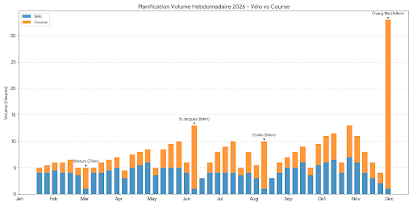

In my [previous post](/posts/ai-coach-series/01-ai-board-of-directors/), I introduced my "Board of Directors" composed of AI agents. The concept is seductive: getting virtual experts to collaborate on designing the ultimate training plan.

But in engineering, we know that **"Theory is when you know everything but nothing works."**

Having a plan generated by an AI isn't enough. It has to be executable, **physiologically safe**, and adapted to my actual constraints. I’m not a certified coach, but I have experience (40 pro Muay Thai fights) and I know how to read the documentation.

So, I treated this AI-generated plan like a critical **Pull Request**. I subjected it to a ruthless **Code Review**, confronting the Generator (Gemini) with an Adversarial Agent (ChatGPT), industry standards, and my own "Ground Truth."

> **🎯 Who is this for?**
> This post is for engineers who train seriously — or athletes who think like engineers.

Here is the "Design Time" for my 2026 season.

## 1. Legacy Code Audit: Lambo Engine, 2CV Chassis

To generate this plan, I avoided generic templates. I fed the model **3 years of logs** (Trainingpeaks exports). The AI started with an audit of the "Legacy System" (my body) and detected major issues.

### A. Observability Failure (The 100k Post-Mortem)
The AI replayed the logs from my previous preparation (a stock plan bought on TrainingPeaks). It spotted a bug I had missed: a continuous drop in HRV (Heart Rate Variability) **specifically during recovery weeks**.

**The Diagnostic: Bad Polarization.**
1.  **Insufficient Deload:** The volume didn't drop enough during assimilation weeks to allow true recovery.
2.  **Timing Error:** High intensity sessions were scheduled too late in the recovery week, preventing the HRV from bouncing back before the next block.

**The Result:** I started every new block already "fried." This accumulated fatigue led directly to an injury (**Plantar Fasciitis**) that plagued me for months.

### B. Hardware Specs
Gemini dropped a stinging metaphor that became the cornerstone of my entire planning:

> **"Coach Trail (Gemini):** You have a Lamborghini engine mounted on a Citroën 2CV chassis."

**Translation:** My cardio engine (acquired through years of fighting) is massive. However, my mechanical structure (tendons, feet) is the **Single Point of Failure (SPOF)**. If I run as much as my engine allows, I break the chassis.

### C. Initial Boot: System in "Safe Mode"
To verify the model's reactivity, I initialized the plan at the worst possible moment.
**Context:** I had just finished an Ultra in Thailand, flew back (massive jet lag), and immediately caught a fever.
**Metrics:** My HRV was at an all-time low. The dashboard was flashing red.

A bad coach (or a dumb algorithm) might have tried to force the schedule.
Gemini immediately triggered a **Fail-Safe Protocol**.
* **Response:** It refused to schedule any intensity.
* **Strategy:** It switched to "Aggressive Recovery" (Sleep maximization + strict Zone 1).
* **Verdict:** It correctly identified that before building new features (Fitness), we had to patch the server (Recovery). This initial "Safe Mode" behavior validated its safety layers from Day 1.

## 2. System Architecture: Load Balancing

To bypass the bottleneck (plantar fasciitis), the AI proposed a strong architectural decision: **Load Balancing**.

Instead of betting everything on running (high impact), the plan shifts a massive load of the aerobic volume to a third-party "Micro-service": **Cycling (Home Trainer)**.

* **Blue (Bike):** We build the base without wearing out the disks (the feet).
* **Orange (Run):** We switch to specificity (running) only when approaching "Production Deployments" (races).

> **💡 Key Takeaway:**
> Treat injuries as "Technical Debt." If you can't refactor the code (heal instantly), you must build a workaround (Load Balancing) to keep the system running.

## The Reality Gap: Why Validation Matters

Why go through a complex adversarial review? Why not just trust the model?

Because Generative AI optimizes for **plausibility**, not **safety**. Without strict constraints, an LLM can hallucinate a workout that looks valid syntactically but is physiologically suicidal.

*Fig 2. The Danger Zone. While the "Bear Fight" is obvious, the real danger comes from subtle bugs—like a plan that forgets intensity for 3 months.*

To avoid these "silent failures," I established a strict testing protocol.

## 3. Compliance Testing: The "Friel" Standard

I ran the plan against an absolute reference: **Joe Friel** (author of *The Triathlete's Training Bible*). To me, this book is the "Official Documentation" (RFC) of endurance engineering.

I set up a **Unit Testing Suite** to verify if the code generated by Gemini complied with Friel's specs.

* **🧪 Test 1: Polarization (The 80/20 Rule)**
    * *Check:* Is training volume ~80% Zone 2 and ~20% Intensity?
    * *Result:* **✅ PASS.** No "Zone 3 plateau" (junk miles) detected.
* **🧪 Test 2: Progressive Overload**
    * *Check:* Is the ramp rate linear? No sudden spikes in TSS (Training Stress Score)?
    * *Result:* **✅ PASS.**
* **🧪 Test 3: Spectrum Coverage**
    * *Check:* Are all energy systems (VO2, Threshold, Aerobic) represented to avoid de-training?
    * *Result:* **✅ PASS.**
* **🧪 Test 4: Specificity (Event Parity)**
    * *Check:* Does training resemble the race more closely as we approach the date?
    * *Result:* **✅ PASS.** (VO2Max early in the season -> Specific Endurance late in the season).

## 4. The Adversarial Code Review

This is the most critical part. I used a second LLM (ChatGPT) in "Adversarial" mode to challenge Gemini's choices. Two specific "Pull Request" debates shaped the final plan.

### Case A: The 4:1 Cycle (Bug or Feature?)

**The Issue:** The academic standard is 3 weeks of load / 1 week of recovery. Gemini scheduled **4-week load cycles**.

**🧑‍💻 Me:** *"Why 4 weeks? It’s risky. Standard is 3:1."*

**🤖 Gemini (Architect):** *"This is **Functional Overload**. Since you are a Hybrid profile (50% cycling), your joints don't suffer the impact stress of a pure runner. We can stretch the cycle to build a deeper base."*

**🕵️‍♂️ ChatGPT (Reviewer):** *"Technically sound, **BUT** valid only with real-time monitoring. If HRV drops, you must cut the cycle immediately."*

**Verdict:** ✅ **Merged.** I accepted the 4:1 cycle, but with a strict condition: **Dynamic Piloting** based on daily HRV.

### Case B: The "Missing VO2Max" Bug

**The Issue:** In Phase 4 (Specific Prep), the plan removed *all* high-intensity work.

**🧑‍💻 Me:** *"No VO2Max for 8 weeks? My running economy will collapse."*

**🤖 Gemini:** *"It’s a feature. For 100 Miles, we want a Diesel engine. High intensity + High Volume = Injury."*

**🕵️‍♂️ ChatGPT (Reviewer):** *"The safety logic is good, but the user is right: cutting intensity completely creates a 'de-training' risk for the nervous system."*

I sent this feedback back to Gemini. Its response was a masterclass in **Refactoring**.

**🤖 Gemini (Refined):** *"Ok, validated. We apply a **Hybrid Strategy**:*
1.  *VO2Max/Power kept **exclusively on the bike** (Zero impact).*
2.  *On foot: Tempo on hills and 'Eccentric loading' on downhills."*

::: {layout-ncol=2}
.png)

:::
*Comparison: On the left, the "Diesel only" risk. On the right, intensity reminders (orange/red) are preserved thanks to the review.*

> **💡 Key Takeaway:**
> Use one LLM to generate (The Creative) and another to critique (The QA). The friction between the two often produces a better solution than either could alone.

## Conclusion: Ready to Deploy?

At the end of this "Design Time" phase, I have a plan that:
1.  Respects my Hardware constraints (2CV Chassis).
2.  Passed the Physiological Unit Tests.
3.  Was validated by a contradictory review.

Everything looks perfect on paper. But as every developer knows, **nothing survives first contact with Production.**

As early as the second week, I suffered a critical incident: an ankle sprain. In the next article (Part 3), I will show you how the AI handles **"Run Time"**, medical Hotfixes, and dynamic adaptation.

*Stay tuned.*