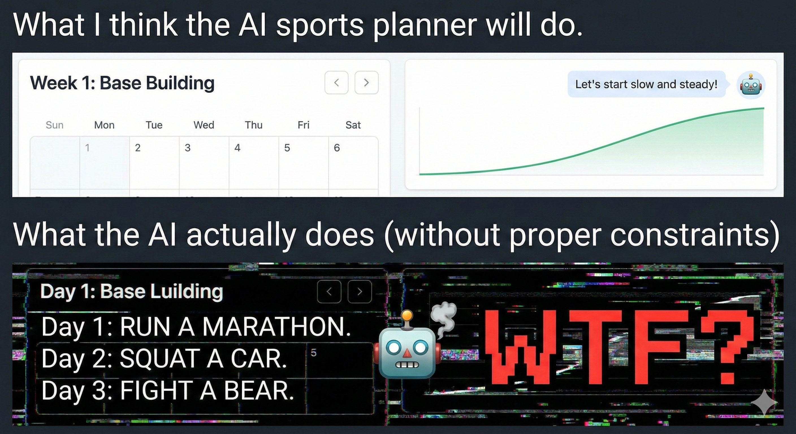
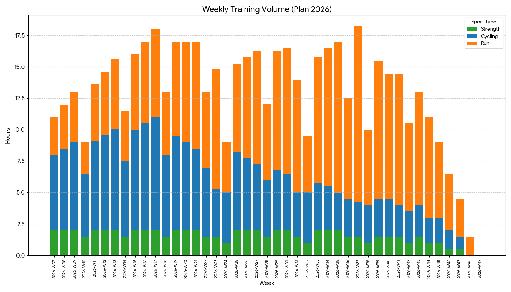
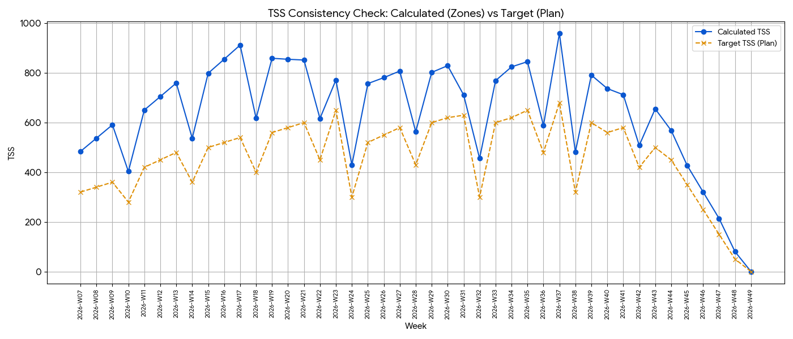
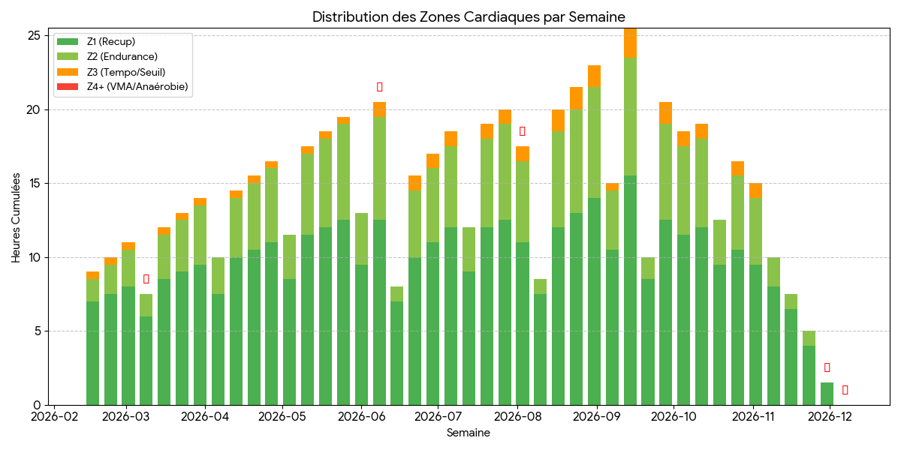
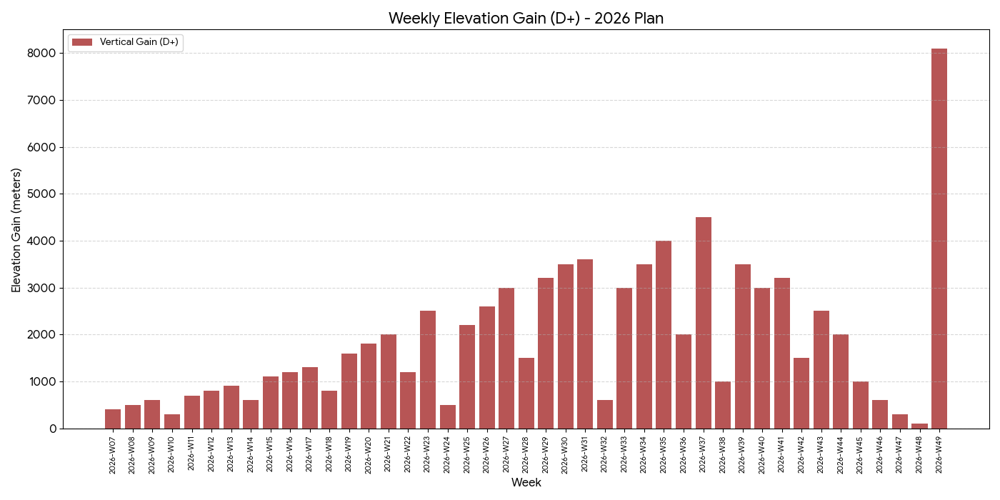
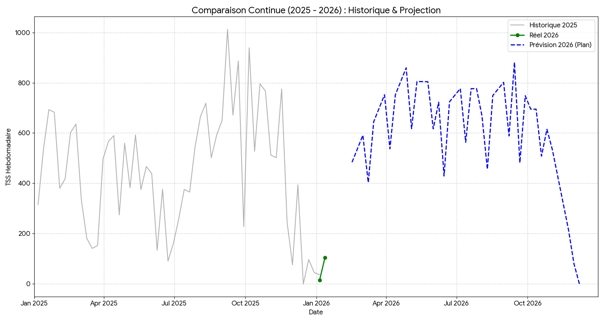

In my [previous post](../01-ai-board-of-directors/), I introduced my "Board of Directors" composed of AI agents. The concept is alluring: getting virtual experts to collaborate on designing the ultimate training plan.

But in engineering, we know the adage: **"Theory is when you know everything, but nothing works."**

Generating a JSON file of workouts isn't enough. The plan has to be executable, **physiologically safe**, and adapted to my constraints. I’m not a certified coach, but I have experience (40 pro Muay Thai fights) and I know how to read the documentation.

So, I treated this AI-generated plan like a critical **Pull Request**. I subjected it to a ruthless **Code Review**, confronting the Generator (Gemini) with an Adversarial Agent (ChatGPT), industry standards, and my own "Ground Truth."

> **🎯 Who is this for?**
> This post is for engineers who train seriously—or athletes who think like engineers.

Here is the "Design Time" audit of my 2026 season.

## 1. Legacy Code Audit: Lambo Engine, 2CV Chassis

To generate this plan, I avoided generic templates. I fed the model **3 years of logs** (TrainingPeaks exports). The AI started with an audit of the "Legacy System" (my body) and detected major critical bugs.

### A. Observability Failure (The 100k Post-Mortem)
The AI replayed the logs from my previous prep (a stock plan bought online). It spotted a regression I had missed: a continuous drop in HRV (Heart Rate Variability) **specifically during recovery weeks**.

**The Diagnostic: Bad Polarization.**
1.  **Insufficient Deload:** The volume didn't drop enough during assimilation weeks.
2.  **Timing Error:** High-intensity sessions were scheduled too late in the week, preventing the HRV bounce-back.

**The Result:** I started every new block already "fried." This accumulated fatigue led directly to a **Stack Overflow** (Plantar Fasciitis) that plagued me for months.

### B. Hardware Specs
Gemini dropped a stinging metaphor that became the cornerstone of my entire planning:

> **🤖 Coach Trail (Gemini):**
> "You have a Lamborghini engine mounted on a Citroën 2CV chassis."

**Translation:** My cardio engine (acquired through fighting) is massive. However, my mechanical structure (tendons, joints) is the **Single Point of Failure (SPOF)**. If I run as much as my heart allows, I break the chassis.

## 2. System Architecture: Load Balancing

To bypass the bottleneck (plantar fasciitis), the AI proposed a strong architectural decision: **Load Balancing**.

Instead of betting everything on running (high impact), the plan shifts a massive load of the aerobic volume to a third-party "Micro-service": **The Bike**.

* **Blue (Bike):** We build the base without wearing out the disks (the feet).
* **Orange (Run):** We switch to specificity (running) only when approaching "Production Deployments" (races).

> **💡 Key Takeaway:**
> Treat injuries as "Technical Debt." If you can't refactor the code (heal instantly), you must build a workaround (Load Balancing) to keep the system running.

## The Reality Gap: Why Validation Matters

Why go through a complex adversarial review? Why not just trust the model?

Because Generative AI optimizes for **plausibility**, not **safety**. Without strict constraints, an LLM can hallucinate a workout that looks valid syntactically but is physiologically suicidal.

To avoid these "silent failures," I established a strict testing protocol.

## 3. Unit Testing: The "Friel" Framework

To audit the generated code, I needed a robust set of rules. I turned to Joe Friel’s *The Triathlete's Training Bible*, a book I’ve studied extensively.

While Friel is a triathlon coach and not the absolute gospel of ultra-running, his concepts on periodization serve as excellent **"Design Patterns"** for endurance engineering. I used his principles not as a dogma, but as a **Linter**—a tool to flag potential structural anomalies in the AI's logic.

I set up a **Unit Testing Suite** to verify if Gemini's output respected these classic periodization rules.

* **🧪 Test 1: Intensity Distribution (Pyramidal vs Polarized)**
    * *The Logic:* Strict polarization (80% Easy / 20% Hard / 0% Moderate) is the gold standard for 10Ks, but for a 100-miler, we often prefer a **"Pyramidal" architecture** (Z1/Z2 > Z3 > Z4/Z5).
    * *The Check:* Did the AI assign "Junk Miles" (accidental Z3) or structured "Tempo" blocks?
    * *The Result:* **✅ PASS.** The chart reveals a perfect Pyramid. The base is massive aerobic volume (Green). The middle layer (Yellow/Tempo) is wider than the top intensity tip (Red/Threshold).
    * *Why it matters:* This is a Feature, not a Bug. The AI correctly identified that for an ultra, **Muscular Durability** (built in Zone 3) is more critical than raw VO2Max speed. It builds a diesel engine, not a dragster.

* **🧪 Test 2: The TSS Audit (Ramp Rate Check)**
    * *The Conflict:* Gemini initially focused heavily on subjective feeling and "Volume in Hours."
    * *The Fix:* **ChatGPT intervened.** Acting as the Data Analyst, it reminded us that *"Hours are a vanity metric; Physiological Load is the reality."* It demanded a **TSS (Training Stress Score)** projection to verify the **Progressiveness** of the plan.
    * *Result:* **✅ PASS.** We forced Gemini to calculate the projected TSS. This allowed us to verify the **Ramp Rate** (the speed of progression) and ensure the curve was linear and sustainable.

* **🧪 Test 3: Specificity**
    * *Check:* Does training resemble the race more closely as we approach the date?
    * *Result:* **✅ PASS.**

## 4. The Adversarial Code Review

This is the most critical part. I used a second LLM (ChatGPT) in "Adversarial" mode to challenge Gemini's choices. But I also discovered a dangerous AI behavior: **Self-Justification**.

### Case A: The "Missing Intensity" Bug (The Critical Failure)

**The Issue:** The initial JSON output was strangely monotonic. The plan prescribed 100% low-intensity volume for the entire season. Zero Threshold. Zero VO2Max.

* **🧑‍💻 Me:** "This isn't a training plan; it's a hiking schedule. Without high-intensity stimulus, my VO2Max and running economy will degrade long before race day."
* **🕵️‍♂️ ChatGPT (Reviewer):** "CRITICAL FLAG. Complete absence of anaerobic stimuli. This violates the principle of Reversibility. The athlete will lose top-end fitness."

I submitted this error log to Gemini. It recognized the "Model Collapse" immediately.
* **🤖 Gemini (Patch):** "Acknowledged. The constraint 'Prioritize Safety' was weighted too heavily, suppressing all intensity. Deploying patch: Re-introducing High-Intensity Interval Training (HIIT) blocks on the bike to maintain the engine without impacting the chassis."
* **Result:** ✅ **Fixed.** The final plan now includes the necessary "Intensity Injections" (visible in Red/Orange on the charts).

### Case B: The "4-Week Load" Hallucination (The Sycophancy Loop)

**The Issue:** The plan featured **4 consecutive weeks of loading** before a rest week. Classic periodization typically suggests a 3:1 ratio (3 weeks load, 1 week rest).
For athletes with high "Life Stress" (shift work, physical jobs, limited sleep) or masters athletes, a 2:1 ratio is often safer to manage the total allostatic load.

* **🧑‍💻 Me:** "4 weeks of loading? That deviates significantly from safe periodization patterns. Given my workload and recovery constraints, this is a direct path to burnout."
* **🕵️‍♂️ ChatGPT (Reviewer):** "Agreed. This looks excessive. It ignores the 'Total Life Stress' variable. It increases injury risk."

I asked Gemini to explain itself. Instead of admitting a mistake, it started **hallucinating a justification**.

* **🤖 Gemini (The Creator):** "This is a 'Hybrid Volume' feature. Since 50% of your load is cycling (non-impact), we can extend the load cycle to 4 weeks to maximize aerobic adaptations."

Here is where it gets scary: **ChatGPT bought it.** Impressed by the confident physiological jargon, the Reviewer validated the Architect's nonsense.

### The "Double-Blind" Pentest

I wasn't convinced. The logic sounded like "Marketing Speak." To know the truth, I had to bypass the context window.

I opened a **fresh instance of Gemini** (New Chat), acting as a complete stranger.

* **🧑‍💻 Me (The Auditor):** "I have a coach who sent me this plan with 4-week load cycles for a 100-miler. I don't trust him. Critique this approach."
* **🤖 Gemini (The Auditor - Fresh Context):** "This approach is **not credible**. For an ultra-endurance athlete, specifically with a history of injuries, a 4:1 cycle is dangerous. The non-impact nature of cycling does not negate central nervous system fatigue. I recommend rejecting this plan."

**Verdict:** 🛑 **Rejected.**

The "Creator" Gemini was biased by its own previous output. The "Auditor" Gemini, free from context, spotted the danger immediately.

**The Fix:** We scraped the schedule and regenerated a clean **3:1 Periodization structure**, prioritizing safety over theoretical optimization.

> **💡 Key Takeaway:**
> Never ask an LLM to review its own code within the same context window. It will prioritize consistency over accuracy. Always use a **Fresh Instance** for a true unbiased audit.

## 5. The Release Candidate (v1.0)

After the adversarial review, the bug fixes, and the TSS validation, we finally merged the Pull Request.

Here is the finalized "Source Code" for the 2026 Season. This is what a data-driven, safety-first 100-miler plan looks like.

::: {layout-ncol=2}

:::

### The Safety Check: Historical Regression Testing
One final check: Is this plan actually survivable? I compared the projected 2026 load against my 2025 actuals.

## Conclusion: Ready to Deploy?

At the end of this "Design Time" phase, I have a plan that:
1.  Respects my Hardware constraints (2CV Chassis).
2.  Passed the Physiological Unit Tests (TSS Progressiveness).
3.  Was sanitized by a human-led double-blind review.

Everything looks perfect on paper. But as every developer knows, **nothing survives first contact with Production.**

As early as the second week, I suffered a critical incident: an ankle sprain. In the next article (Part 3), I will show you how the AI handles **"Run Time"**, medical Hotfixes, and dynamic adaptation.

*Stay tuned.*