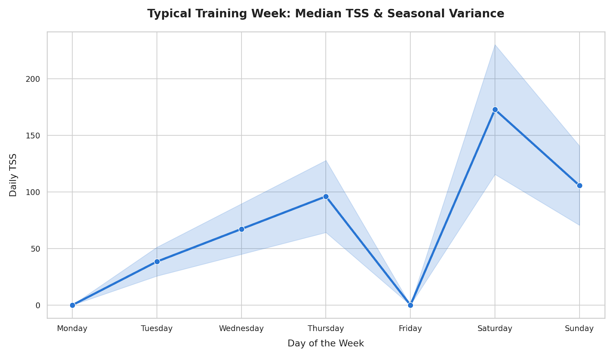

In the previous episodes ([Architecture](../01-ai-board-of-directors/) and [Validation](../02-from-generation-to-validation/)), we built the "Master Plan" for my 2026 season. We ended up with a perfect JSON file, physiologically validated, covering 6 months of training.

In traditional project management, this is called the **Waterfall** model.
But in tech (and in life), Waterfall doesn't work.
Why? Because reality has high entropy.

* A release pipeline breaks on a Tuesday.
* A critical production bug hits on Thursday.
* Sleep quality drops on Friday.

If I follow my static JSON plan to the letter, I am heading straight for a system crash. I need agility.

In this episode, I document how I transform the LLM from a "System Architect" into a weekly **Scrum Master** to handle the "Runtime" operations.

## 1. The Design Pattern: Context-Aware Architecture

Before we can be agile, we need a robust baseline. 
Most training plans fail because they fight your schedule. They put long runs on days where you have 2 hours of commuting.

I built my "Default Week" around my professional constraints (Hybrid Work: Remote 2 days, Office 3 days).

### The "Office vs Remote" Algorithm

*   **Remote Days (Tue/Thu):** No commute. Full control of nutrition and time. 
    *   *Strategy:* **High Load.** This is where we place double thresholds or long sessions (e.g., Thursday is a 2h Bike + Strength).
*   **Office Days (Mon/Fri):** Commute stress, social drain, unpredictable hours.
    *   *Strategy:* **Low Load / Recovery.**

### The "Friday Taper" Strategy

I made a specific engineering decision: **Friday is off (or very light).**
Most runners rest on Monday. I rest (active recovery) on Monday, but I keep Friday purposefully light (7% of weekly load) for one reason: **The Weekend Block**.

To survive the massive back-to-back volume on Saturday/Sunday (which accounts for ~58% of the total load), I need to enter the weekend with a full battery.

**My Typical "Sprint Backlog" (derived from the 4-week Block Plan):**

*   **Mon (0%):** OFF (Office Day).
*   **Tue (8%):** Intervals + Run (Remote Day).
*   **Wed (14%):** Aerobic Endurance (Run).
*   **Thu (20%):** Long Bike 2h + Strength (Remote Day).
*   **Fri (0%):** OFF (Office Day - Battery Saving).
*   **Sat (36%):** Long Bike / Specific work (The big load).
*   **Sun (22%):** Long Run / Hiking (Cumulative fatigue).

---

## 2. The Sunday Ritual: Sprint Planning

This "Default Architecture" works 80% of the time. 
But then, life happens.

I generate my plans in **4-Week Blocks** (Meso-cycles). But a block is just a theory.
Every Sunday evening, I open a session with my "Coach" agent. The goal is to **Commit** to the upcoming week of the block, checking it against the reality of my Google Calendar.

I treat my training week exactly like a **Sprint**.

*   **The Backlog:** The workouts prescribed by the Master Block Plan.
*   **The Constraints:** My Gmail/Calendar, release deadlines, and cognitive load.
*   **The Definition of Done:** Successfully executing the key volume (especially the Weekend Block) without generating "Technical Debt".

### The Scenario: "The Thursday Crash"

Here is a real example of a **Sprint Planning** prompt where the "Default Week" collided with reality.

> **🧑‍💻 Me (Sunday Prompt):**
> "Context: Week 5 of General Prep.
> **The Backlog (Default):**
> - ... [Standard Schedule as defined above] ...
>
> **The Constraints (Reality):**
> - **Thursday (Critical):** I have an all-day on-site workshop instead of my usual Remote day. I cannot do the planned '2h Bike + Gym'.
> - **Friday:** Remote (Exception).
> - **Physiological State:** Good, ready to push.
>
> **Task:** Refactor the week.
> **Goal:** Preserve the Thursday volume (Key Session) but clear the calendar for the workshop.

---

## 3. The Refactoring Logic: "Cognitive Load Balancing"

This is where Gemini shines. It doesn't just move blocks around; it understands the physiology of stress.

> **🤖 Coach Trail (Gemini - Response):**
> "Conflict Detected on **Thursday**: The proposed workshop will drain your cognitive battery. Doing a 2h Bike session afterwards is suboptimal and logistically impossible.
>
> **Proposed Refactoring (Sprint Plan v1):**
>
> *   **Wednesday:** Remain as is (Aerobic).
> *   **Thursday (The Workshop):** **DOWNGRADE** to Rest Day. Focus on nutrition and hydration during the workshop.
> *   **Friday (Remote Exception):** This is now your loading day. Move the **2h Bike + Gym** here. Since you are remote, you can execute this high-volume block.
> *   **Saturday/Sunday:** Remain as is.
>
> **Warning:** You will have a 'Super Block' (Fri/Sat/Sun). Ensure sleep is prioritized on Friday night."

The AI prevents me from trying to "squeeze it in" on Thursday, which would have resulted in burnout, and creates a logical solution that utilizes the remote Friday.

### Lesson Learned: AI as a Guardrail

Without the AI, I probably would have forced the run on Thursday evening: *"It's on the plan, I'm not weak, let's do this."*
Probable result: A low-quality "junk mile" session, terrible sleep, and a high risk of illness or injury 3 days later.

The AI, cold and logical, prioritized **System Preservation**. It applied a security patch before the bug even occurred.

---

## 4. Micro-Adjustments: The Daily Stand-up

Sometimes, even Sprint Planning isn't enough. On Wednesday morning, I might wake up with my HRV (Heart Rate Variability) in the red.

I run a quick "Daily Stand-up" with the bot:

> **🧑‍💻 Me:** "HRV dropped by 15ms. Resting Heart Rate +4bpm. I slept badly."
>
> **🤖 Coach Trail:** "Flag raised. The planned Threshold session is too taxing for today's system status.
> **Hotfix:** Downgrade session to 'Zone 2 Steady State'. Do not exceed 135 bpm. We will re-evaluate intensity for Saturday."

This is **Real-Time Adaptability**.
A static PDF plan doesn't know you slept poorly. A human coach knows, but they aren't awake at 6:00 AM while you're drinking your coffee. The LLM is always there to adjust the load.

---

## Conclusion: Consistency over Perfection

Using LLMs at this "Runtime" stage taught me one essential engineering truth:
**Consistency beats Intensity.**

By using AI to negotiate with my professional schedule, I transformed "chaotic" weeks (where I would have normally skipped 50% of sessions) into "optimized" weeks (where I did 90% of the volume, just arranged differently).

I now have a manual workflow that works:
1.  **Macro:** The Season Plan (Episode 2).
2.  **Micro:** The Weekly Sprint Planning (This Episode).

However, being the "data mule" that copy-pastes metrics between Garmin, Strava, and Gemini is starting to feel tedious. I am an engineer; I hate manual repetitive tasks.

In the next episode, we are going **DevOps**. I will show you how I wrote Python scripts to **automate this pipeline** and connect the AI directly to my physiological telemetry.

*To be continued...*