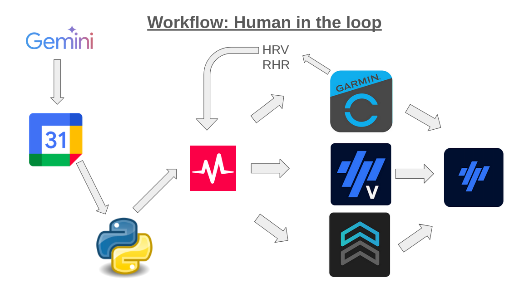

## The "Last Mile" Problem of AI Coaching

In [Episode 1](../01-ai-board-of-directors/index.html), we designed the strategy. In [Episode 2](../02-from-generation-to-validation/index.html), we validated the plan. In [Episode 3](../03-the-runtime-loop/index.html), we adapted the plan to the chaos of real life. Now comes the boring part: **Data Entry**.

You have a perfect 4-week block generated by Gemini Advanced. It exists as a beautiful markdown table in your chat window. But your Garmin watch doesn't read markdown.

Manually creating 28 workouts in Garmin Connect or TrainingPeaks takes about **90 minutes** of clicking, dragging, and typing.
Worse, it is **highly error-prone**. Selecting "Zone 5" instead of "Zone 2" by mistake during a manual entry can ruin a session.

> **The Goal**: A "Zero-UI" workflow. I want to chat with my coach (Gemini) on my phone, approve the plan, and wake up the next morning with the workout already loaded on my watch.

## The Stack: Google Calendar as a Database

Why build a custom app when Google has already built the perfect infrastructure?

1.  **Frontend**: **Google Gemini App** (Mobile). It has native integration with Google Workspace. I can say *"add these sessions to my calendar"* and it just works.
2.  **Database**: **Google Calendar**. It handles timezones, recurrence, and drag-and-drop rescheduling seamlessly.
3.  **The Engine**: **Project Chiang M-AI** (My Python Script). A simple automation tool that reads the calendar and pushes to the fitness ecosystem.
4.  **The Bridge**: **Intervals.icu**.
    *   *Why not TrainingPeaks?* I have a Premium TP account, but their API is closed to individual developers.
    *   *Why Intervals.icu?* It has an open API and pushes workouts to Garmin, Wahoo, Zwift, and TrainingPeaks Virtual automatically.

## The Architecture



## The Workflow: From Text to Tarmac

I've been using this system for a couple of weeks now, and it has completely removed the friction of managing a complex plan.

Here is the loop that runs my training:

### Step 1: The Plan
I open the Gemini app on my phone.
> *"Context: Week 3/4. Heavy Load. Focus: VO2 Max. Generate the specific sessions."*

Gemini outputs the JSON structure for the workouts. I verify it.
> *"Looks good. Schedule them in Google Calendar."*

**Done.** Gemini calls the Google Calendar API itself (via the **Google Workspace Extension**) and places the events in my "Training" calendar.

### Step 2: The Data Schema (Taming the AI)
As a Data Scientist, my biggest fear with Large Language Models is **hallucination**. I don't want Gemini accidentally prescribing a "Zone 6 Heart Rate" (which generally implies cardiac arrest).

But beyond AI, this solves a **Human Error** problem. 
I have a confession: Before automating this, I frequently messed up manual data entry in TrainingPeaks. Entering `Zone 1` instead of `Zone 5` is obvious and easy to spot. But typing `Zone 4` instead of `Zone 3`? Unnoticeable on the screen, until you are on the trail and your watch forces you into the red for 45 minutes, completely exploding your fatigue score for the week.

To bridge the gap between probabilist AI, clumsy human fingers, and the deterministic API of intervals.icu, I built a strict validation layer using **Pydantic**. 
If Gemini provides parameters that physically don't make sense or aren't parsable into my exact Lactate Threshold zones, the pipeline rejects it *before* it ever gets sent to my watch.

*The validation layer is implemented using Pydantic models that enforce strict constraints on zones, durations, and workout structure before any API call is made. You can find the implementation in the GitHub repository.*

### Step 3: The Sync
I run my script:
```bash
python -m project_chiang_m_ai sync --block
```
The script:
1.  Reads the Google Calendar events.
2.  Validates the workout structure.
3.  Uploads them to Intervals.icu.
4.  Intervals.icu pushes them to my Garmin Forerunner 955 and Wahoo ELEMNT ROAM.

### Step 4: The Backward Loop (Daily Feedback)
This is where the system actually becomes a "Coach" and not just a "Plan Generator".

Every morning, I give Gemini my context:
> *"Morning Check-in. HRV is 50ms (baseline 75ms). Resting HR is up +5bpm. Feeling drained."*

Gemini analyzes the state and decides to adapt:
> *"Recovery required. I am downgrading today's Threshold session to a Zone 2 recovery ride. Updating your calendar now."*

Gemini **updates the Google Calendar event directly**.
My script detects the change, deletes the old high-intensity session from Intervals.icu, and pushes the new recovery ride.

## Running, Cycling & Strength: What works?

The script currently handles 3 types of workouts, but with different levels of integration:

1.  **Running**: 🟢 **Fully Automated**. Workouts are built using **% of Lactate Threshold Heart Rate (LTHR)**. They sync perfectly to my Garmin.
2.  **Cycling**: 🟢 **Fully Automated**. Workouts are built using **% of FTP (Power)**. They sync to Garmin, Wahoo, and Zwift.
3.  **Strength**: 🟡 **Partially Automated**. I have implemented the *Strength Workout* model in the script. It successfully uploads the text description to Intervals.icu, but the API bridge to Garmin currently *does not* support pushing step-by-step strength workouts to the watch. For now, I read the plan on my phone for these sessions.

## Conclusion

We often over-engineer "Apps" when "Scripts" are enough. By leveraging existing robust tools (Google Calendar + Intervals.icu API), I built a complete Coaching Platform that is responsive, automated, and error-free.

This allows me to spend time on what matters: **Running the miles**, not managing the database.

I open-sourced the tool here: [github.com/nakmuaycoder/project-chiang-m-ai](https://github.com/nakmuaycoder/project-chiang-m-ai).
