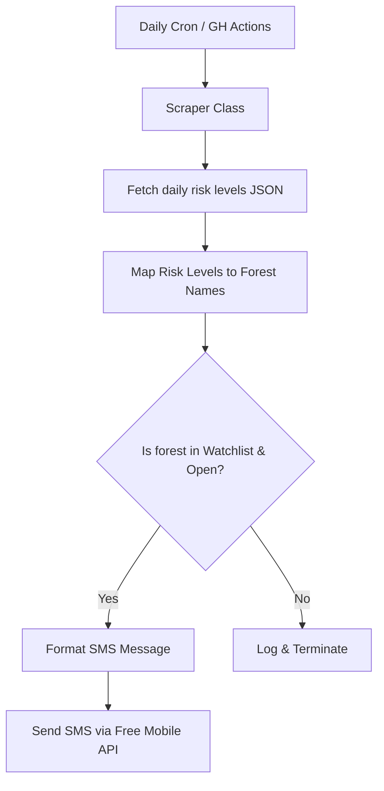

## The Summer Trail Dilemma

Training for a 160km ultra-trail like the Hoka Chiang Mai requires massive volume, which means hours spent on forest trails. However, training during the summer in Southern France (especially around areas like the Bouches-du-Rhône, Var, or Vaucluse) introduces a significant logistical challenge: **wildfire prevention regulations**.

From **June 1st to September 30th**, access to forest massifs is strictly regulated. Depending on heat, wind, and dryness, prefectures assess the risk levels daily. If the risk is too high (Levels 3 & 4), the forests are completely closed to the public. 

This isn't just about avoiding a hefty €135 fine; it's a matter of life and death. **90% of forest fires are caused by human activity**. Keeping people out of the woods during critical risk days prevents accidental fires and keeps hikers and runners out of harm's way, allowing emergency services to focus on active fire fronts if needed.

The rules are updated daily around 5:00 PM (17h) for the following day. Checking the prefecture's website manually every evening to decide *where* I can safely run the next morning became a tedious manual step—a friction point in the "Zero-UI" training setup.

To solve this, I built [where-to-run-today](https://github.com/nakmuaycoder/where-to-run-today), an automated forest fire risk monitor.

{width=800px}

## The Architecture of the Alert System

The system operates as a lightweight, automated pipeline designed to run daily. Here is the structure:

### 1. Fetching the Prefecture Data

The prefecture updates the risk levels on a dedicated platform: `risque-prevention-incendie.fr`. The scraper fetches the detailed daily risk level data directly from the platform's JSON API (e.g., `import_data/{date}.json`). 

The script is designed with defensive fallback logic: it attempts to fetch tomorrow's date first (published in the evening) and falls back to today's date if tomorrow's data is not yet online.

### 2. Translating Levels to Running Safety

The script translates the numerical risk levels (0 to 4) into binary execution signals:
* 🟢 **Levels 1 & 2**: **OPEN** (Access authorized) -> `[OK]`
* 🔴 **Levels 3 & 4**: **CLOSED** (Access prohibited) -> `[KO]`
* ⚪ **Level 0**: No data (typically off-season)

### 3. The SMS Alert System (and API Gotchas)

To get the notification directly on my phone without needing a custom mobile app, I integrated the **Free Mobile SMS API** using my personal library, [freeMobileSMS](https://github.com/nakmuaycoder/freeMobileSMS).

During early testing, I ran into a classic encoding issue. I initially formatted the SMS payload with visual emojis:
* `🟢` for open forests
* `🔴` for closed forests
* `🏃` for the runner icon

While this looked great on paper, the Free Mobile SMS gateway API proved highly sensitive to non-ASCII unicode characters, resulting in silent delivery failures or garbled text. 

To make the system bulletproof, I refactored the formatting logic to use plain text ASCII tags (like `[OK]` and `[KO]`) instead of emojis. This ensures delivery reliability while maintaining clean, legible lists directly on my lock screen.

---

## Automating the Pipeline with GitHub Actions

Instead of hosting this on a dedicated server or relying entirely on a local NAS cron, I configured a **GitHub Actions** workflow to run the checks.

The workflow is scheduled via cron to run automatically every day at **20:00 (Paris time)** (18:00 UTC) during the summer season, which corresponds to the time when next-day access data is guaranteed to be updated by the prefectures.

By specifying the timezone context carefully, we guarantee the check runs after the prefecture's publication deadline. The workflow pulls configuration parameters and API credentials securely from GitHub Repository Secrets:
* `FREE_MOBILE_USER` & `FREE_MOBILE_PASS` for the API gateway.
* `DEPARTMENT` (to target specific regions, e.g. `13` or `83`).
* `WATCHLIST` (a JSON array of specific massifs, like `["Alpilles", "Calanques"]` or `["ALL"]`).

---

## Zero Friction, Zero Fines

With this workflow active, I no longer spend time browsing government websites or risking a fine. Every evening at 20:00, if the Calanques or Alpilles are open for tomorrow, I get a clear, concise SMS. If they are closed, I can pivot my training schedule to road running or treadmill workouts immediately.

Eliminating logistical friction points is just as important as physical training when preparing for a 160km ultra-trail. 

Stay safe, respect the rules, and see you on the trails! 🌲🏃
