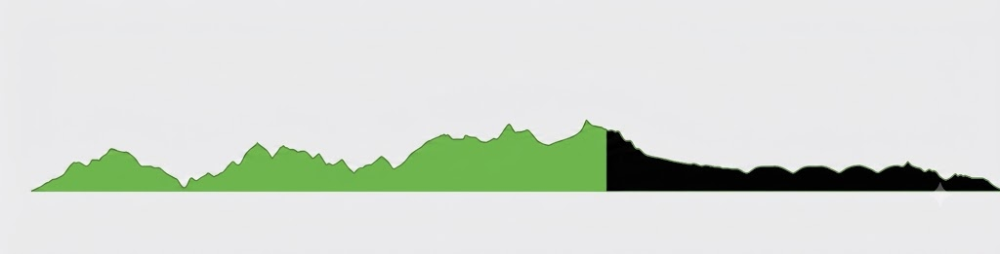
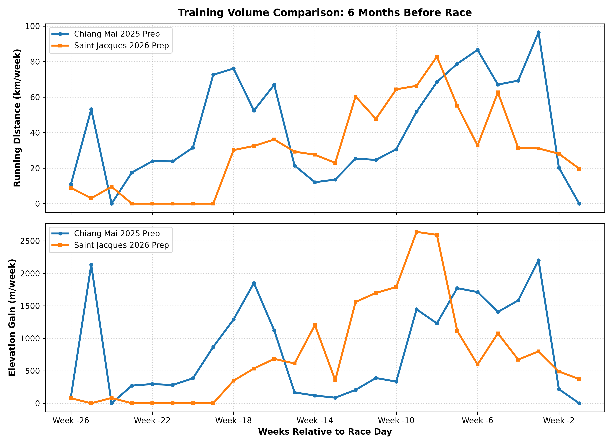
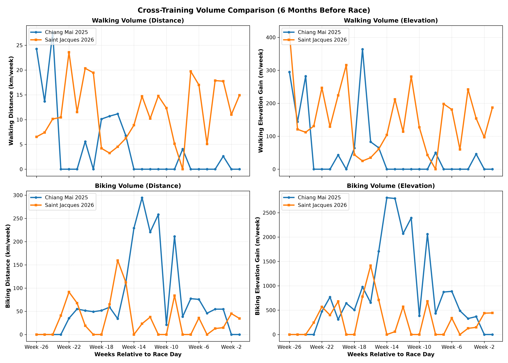
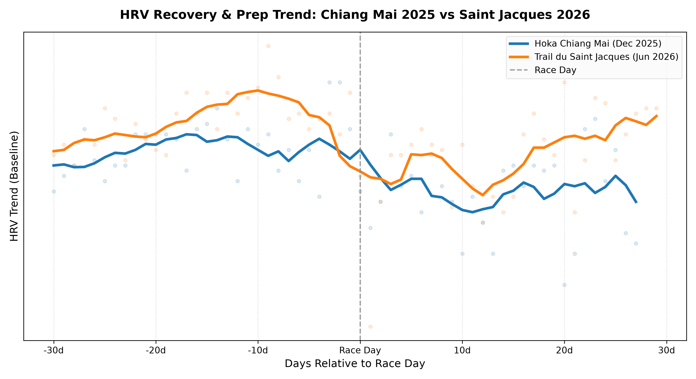

## 1. The Context: A Mid-Season Test

The **Trail du Saint Jacques** (86km, 3500m D+) was meant to be the first real test. A full-scale run to verify if the training logic developed over the first five months of *Project Chiang M-AI* was robust enough for the upcoming 100-miler in Chiang Mai.

### The Goals
1. **Training Validation**: Did the Z2/Z3 training distribution actually build the endurance predicted?
2. **Physical Durability**: Did my joints and tendons (especially the plantar fasciitis) survive long hours of impact?
3. **Nutrition and Hydration**: Did the fueling protocol hold up under real race conditions?

### The Result: A DNF at 70km
Unfortunately, the run ended in a **DNF (Did Not Finish) at 70km (3200m D+)**. It was a failure driven by a combination of extreme heat, running out of water, and mental fatigue, rather than a lack of physical preparation.

---

## 2. Pre-Race: High-Volume April and the Weight Anomaly

My preparation leading to the race was a mix of intense training peaks and AI-prescribed recovery.

### The April Peak
April was a massive training block:
- **Volume**: 95 km per week
- **Elevation**: 3,000m D+ per week
- **Strength**: Heavy focus on resistance and strength training, with a specific emphasis on posterior chain strengthening based on Gemini's recommendation, to build joint integrity.

At this point, I felt incredibly strong physically.

### The May-June Taper & HRV Response
Following this high-intensity peak, Gemini (acting as the coach) prescribed a significant reduction in training volume to allow the body to recover. 

This highlights a major contrast in tapering strategies between the two preparations:
* **Chiang Mai 2025**: The build-up had almost no deload phase before the race.
* **Saint Jacques 2026**: The deload was extreme, dropping the running volume drastically after the April peak to ensure full recovery.

Physiologically, this extreme deload worked exceptionally well:
- **HRV (Heart Rate Variability)**: Shot up significantly, indicating that the central nervous system was fully absorbing the training load and recovering well.

### The Weight Anomaly: Gaining 5kg
While training and recovery volumes were well-managed, my nutritional intake was not. Between mid-May and early June, I mismanaged my diet. 

Without the high daily caloric expenditure of April's high-volume block, a lack of dietary discipline led to significant weight gain. When I stepped on the scale on race morning, I faced the reality: **+5 kg** gained over the last month and a half.

### 6-Month Training Volume Comparison
Comparing the 6 months of running preparation between the 2025 Chiang Mai and the 2026 Saint Jacques races highlights the difference in volume and vertical training:

To supplement running, cross-training (walking/hiking and biking) was incorporated into the preparation. Below is the comparison of walking and biking volume (distance in kilometers and elevation gain in meters) for the 6 months leading up to both races:

An interesting pattern visible in these comparison plots is the injury period during the 2025 Chiang Mai preparation. Around Week -15, a plantar fasciitis flare-up forced a temporary halt in running. The graphs clearly show this transition: running volume drops to near zero, while biking distance spikes significantly as cross-training was used to preserve aerobic fitness. In comparison, the 2026 build-up to Saint Jacques shows a much more stable and continuous training volume.

---

## 3. Race-Day Analysis: Nutrition, Hydration, and Cramps

### A. Nutrition: A Clear Success
One of the major successes of the day was the carbohydrate intake protocol. 
- **Carbohydrate Target**: Held a steady **90g of carbs per hour**.
- **Outcome**: Absolutely zero gastric distress or GI issues. The digestive system functioned perfectly throughout, confirming that the gut-training and fueling strategy is solid.

### B. Hydration: Running Dry
While nutrition was perfect, hydration suffered a catastrophic failure in the scorching heat.

- **The Incident**: Between Aid Station 3 (R3) and Aid Station 4 (R4), I ran completely out of water. I spent nearly **1.5 hours** without water in the heat.
- **The Crash**: I arrived at R4 severely dehydrated and electrolyte-depleted. 
- **The R4 Recovery**: At R4, I met my wife and mother. To recover, I ate instant noodles (Mama) and drank hot bouillon to replenish sodium. 
- **The Result**: The broth and noodles worked wonders. Even though the dehydration triggered cramps, I was still running strong. When I wanted to, I was galloping like a mountain goat ("cavalais comme un cabri"), easily overtaking other runners. The physical capacity to finish was never the limiting factor.

> **💡 The Real Lesson:** 
> Even when you are at peak fitness, you can blow up not because of physical failure or race difficulty, but due to pure mental weariness ("lassitude"). When the mind gets bored and exhausted, finding a way to shift your focus ("se changer les idées") is the key to survival.

---

## 4. The Mental Game: "The Dark Place" and Social Support

The DNF was ultimately a mental choice, not a physical necessity. I had the legs and the cardiovascular engine to cross the finish line; I simply reached a point of intense boredom ("l'ennui") and mental exhaustion in the heat where I decided I had had enough.

### The Social Boost & The Need for a Trigger
Before reaching R4, I was deep in "the dark place". Seeing my family at the aid station was a massive relief, but it also made it easier to stop. 

In hindsight, my mental drive needed a specific trigger. If my wife had told me a white lie—something like *"I'll be waiting for you at the next aid station"*—it would have instantly reframed the challenge. I wouldn't have DNF'd; I would have taken off like a missile to reach her. Without that external target to chase, the mental fatigue took over.

### The "Phone Call" Strategy
This highlighted how easy it is to spiral when running solo in difficult conditions. 
- **Action Item**: For the next race, when entering a negative mental loop, I will pull out my phone and call someone. Talking to family or a friend is a quick way to break the spiral and clear the mind.

---

## 5. Physical Recovery & Next Steps

Despite the DNF, there is positive news:
1. **No Plantar Fasciitis Issues**: The plantar fasciitis did not cause a single issue during the race. This success is due to the transition to the **Asics Trabuco Max** (cushioning and geometry kept the foot pain-free) and, crucially, the heavy emphasis on posterior chain strengthening during strength training, as recommended by Gemini.
2. **Fast HRV Recovery & Quick Return to Training**: Post-race HRV returned to baseline remarkably fast. This indicates that the foundational cardiovascular engine was well-prepared and did not suffer deep systemic damage.

Comparing the HRV evolution 30 days before and 30 days after both races highlights this difference. Unlike in 2025, where recovery was slower, the 2026 post-race HRV shows a very swift rebound:

This physiological recovery is directly reflected in how quickly training resumed:
* **After Chiang Mai (2025)**: It took **11 days of absolute rest** before attempting a short 4km test run.
* **After Saint Jacques (2026)**: Active recovery (walking and light cycling) started after **just 3 days**, and I resumed structured high-intensity work (10x 1-minute hill repeats) **only 10 days after the race**.

The preparation is working. I just need to fix the hydration issues, manage my weight, and prepare for the mental battles before the main event in Chiang Mai.

Next up: the **Gauja 50k in Latvia** during the summer holidays—a great opportunity to practice mental focus and hydration strategy in a different setting.

---

*Onwards to the final block.*
