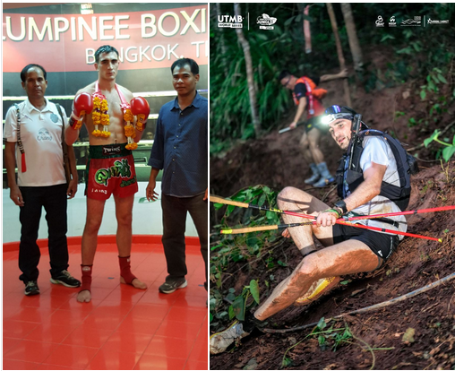

{width=800px}

# Fine-Tuning the Fighter: From Nak Muay to Ultra-Trailer

**Baseline Model:** A physiology overfitted for 5 rounds of explosivity (Muay Thai).  
**New Objective Function:** Maximize endurance over 160km while minimizing the "Injury" loss function.  
**The Optimizer:** Generative AI.

**Project Chiang M-AI** is a live experiment in **Transfer Learning**.  
I am using LLMs to re-weight my fast-twitch muscle fibers into a diesel engine. The goal? Solving a complex domain adaptation problem: taking a body trained on the "Lumpinee Stadium" dataset and deploying it to the "UTMB" distribution.

# The Episodes

---

:::{#episodes-list}
:::